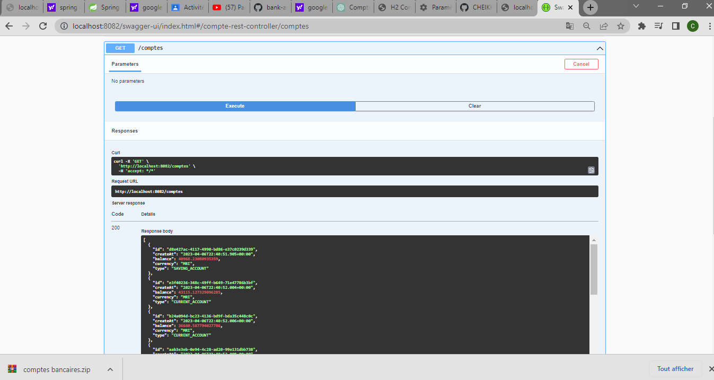
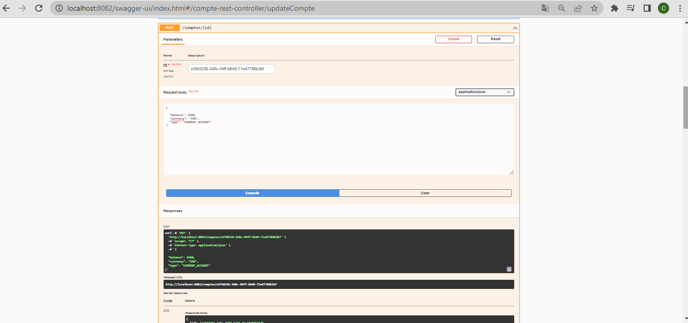
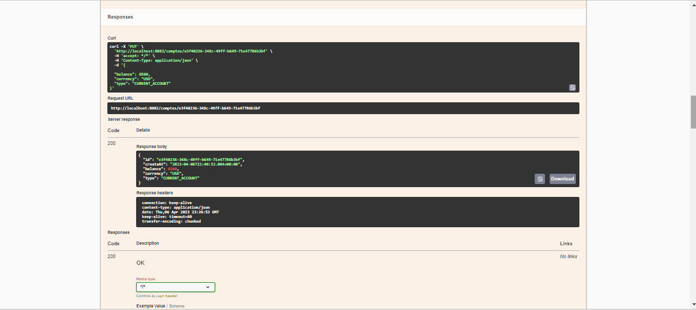

  

<h2>Activité Pratique N°4 : Architectures Micro-services</h2>
<h1>compte rendu</h1>
<h1>Beidja Cheikh</h1>

<h4>1. Créer un projet Spring Boot avec les dépendances Web, Spring Data JPA, H2, Lombok</h4> 

  

<h4>2. Créer l'entité JPA Compte</h4>

  

<h4>3. Créer l'interface CompteRepository basée sur Spring Data</h4> 

  
<h4>4. Tester la couche DAO</h4>
  
  
<h4>5. Créer le Web service Restfull qui permet de gérer des comptes</h4>
  
<h4>6. Tester le web micro-service en utilisant un client REST comme Postman</h4> 
<h5>a- teste de la methode comptes() qui pérmet de return une listes des comptes existent</h5>
  
<h5>b- Test de la methode compte() qui permet de retourner un compte par son id</h5>
  
<h5>c- Test de la méthode saveCompte()</h5>
  
<h5>d- Test de la méthode updateCompte()</h5>
  
<h4>7. Générer et tester le documentation Swagger de des API Rest du Web service</h4>
<h5>a- ajouter la dependencies swagger dans le pom.xml</h5>
  
<h5>voici le documentation Swagger</h5>
  
<h5>I- Test Swagger</h5>
<h6>a- tester la methode getComptes()</h6>
  
<h6>b- tester la methode getCompteById()</h6>
  
<h6>c- tester la methode <b>saveCompte()</h6>

  
<h6>d- tester la methode <b>deleteCompte()</b></h6>
  
<h6>e- tester la methode <b>updateCompte()</b></h6>

  
<h4>8. Exposer une API Restful en utilisant Spring Data Rest en exploitant des projections</h4>
<h5>a- ajouter la dependency spring-data-rest dans le pom.xml</h5>
  
<h5>b- ajouter l'anotation<b> @RepositoryRestResource</b> our dite a spring il demare il creer un web service restful qui permet de gerer lentité Compte </h5>
  
<h5>voici le web service restfull qui est fournir par spring data est bien marche</h5>
  
<h5>une mesthode pour retourn les comptes par le type</h5>
  
<h4>les conptes par le type CURRENT_ACCOUNT</h4>
  
<h4>les conptes par le type SAVING_ACCOUNT</h4>
  
<h4>II- la projection</h4>
  
<h4>Test</h4>
  
<h4>9. Créer les DTOs et Mappers</h4>
<h5>DTOS</h5>
 <h6>CompteRequestDTO</h6>
  
 <h6>CompteResponseDTO</h6>
  
<h5>Mappers</h5>
  
<h4>10. Créer la couche Service (métier) et du micro service</h4>
<h5>L'interface CompteService</h5>
  
<h5>Class CompteServiceImpl qui implimente l'interface CompteService</h5>
<h5>Contient trois méthodes</h5>
<h6>La méthode addCompte</h6>
  
<h6>La méthode updateCompte</h6>
  
<h6>La méthode deleteCompte</h6>
  
<h4>11. Créer un Web service GraphQL pour ce micro-service : </h4>
<h5>creation de file schema.graphqls qui contient les methodes de type <b>Query</b> et les methodes de type <b>Mutation</b></h5>
  
<h5>nous créons un controller graphql </h5>
  
<h5> pour le Test : http://localhost:8082/graphiql?path=/graphql </h5>
<h2><b>Démonstration</b></h2>
<h5>Test methode <b>accountsList()</b> de type Query qui return les comptes existent</h5>
  
<h5>Test methode compteById(id) de type Query qui return un Commpte par sa id</h5>
  
<h5>Test de methode _addCompte(compte) de type Mutation qui pérmét d'enregistré un Compte</h5>  
  
<h5> Test de methode updateCompte(id,compte) qui pérmet de modifier un  compte </h5>
  
<h5>Test methode DleteCompte(id) qui supprime un compte et return true 
si le compte est bien supprimer</h5>  
  
<h5> on ajoute un autre entities Customer avec la relation Bidirectionnel </h5>  
<h5>entities Customer contient un attribut list des comptes avec la relation OneToMany</h5>  
  
<h5>entities Compte contient un attribut de type Customer avec l'annotation ManyToOne </h5>  
  
<h2>Démonstration<h2>  
<h5> Test de la methode customersList() qui return le Customer qui ont  existent </h5>  
  
<h5>Test de methodes accountsList() qui touts les comptes est son customers </5>  
  
<h5>test dune methode addCustomer(customer) qui mermet dajouter un customer</5>  
  

